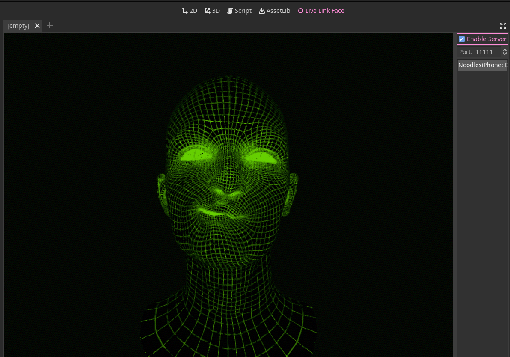

# Godot Live Link Face
A server to recieve facial motion capture data from [Live Link Face](https://apps.apple.com/us/app/live-link-face/id1495370836)

## Features
* Multi threading
* Support for multiple clients
* Builtin debug addon
* Get updates via signals
* access to 61 blendshape values using members `client.values.head_roll`

## How to use
To see how to use this library see the samples in the `examples` folder.
If you want to know details about the protocol you can read [this](doc/proto.md)

## Credits
The included 3d model of a head is licenced under cc0 and was created by john hable you can find it [here](http://filmicworlds.com/blog/solving-face-scans-for-arkit/)

## TODO:
* Properly implement timecodes

# License
Copyright 2023 tbxMb

Permission is hereby granted, free of charge, to any person obtaining a copy of this software 
and associated documentation files (the "Software"), to deal in the Software without restriction, 
including without limitation the rights to use, copy, modify, merge, publish, distribute, 
sublicense, and/or sell copies of the Software, and to permit persons to whom the Software is 
furnished to do so, subject to the following conditions

The above copyright notice and this permission notice shall be included in all copies or 
substantial portions of the Software.

THE SOFTWARE IS PROVIDED "AS IS", WITHOUT WARRANTY OF ANY KIND, EXPRESS OR IMPLIED, INCLUDING 
BUT NOT LIMITED TO THE WARRANTIES OF MERCHANTABILITY, FITNESS FOR A PARTICULAR PURPOSE AND 
NONINFRINGEMENT. IN NO EVENT SHALL THE AUTHORS OR COPYRIGHT HOLDERS BE LIABLE FOR ANY CLAIM, 
DAMAGES OR OTHER LIABILITY, WHETHER IN AN ACTION OF CONTRACT, TORT OR OTHERWISE, ARISING FROM, 
OUT OF OR IN CONNECTION WITH THE SOFTWARE OR THE USE OR OTHER DEALINGS IN THE SOFTWARE.
