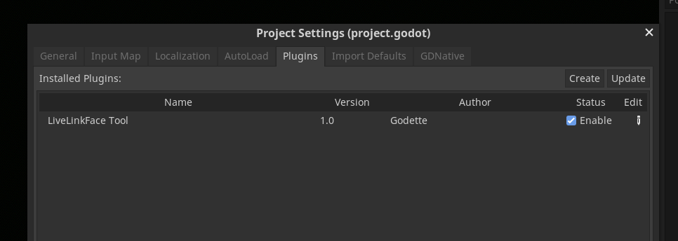
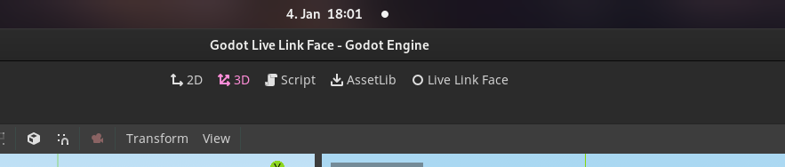
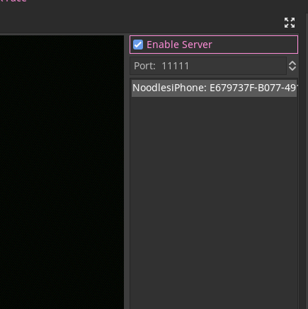

# Addon (Debug/Test utility)
The addon provides a new tab in the editor that shows a face mesh that visualizes the recieved data.

## Installation
To use this addon you must first enable it in the project settings under 'Project' > 'Project Settings' > 'Plugins',

## Usage

Click on the new `Live Link Face` tab and then tick the checkbox in the top right corner with the text `Enable Server`.
Additionally you can also change port using the spinbox underneath the button.

Once a client is connected you can select it in the item box below, selecting items in said box will change the source of the data used by the visualisation.

**Note:** The server will stop when you leave the tab and resume when you return to it. So you don't have to worry about performance issues.
